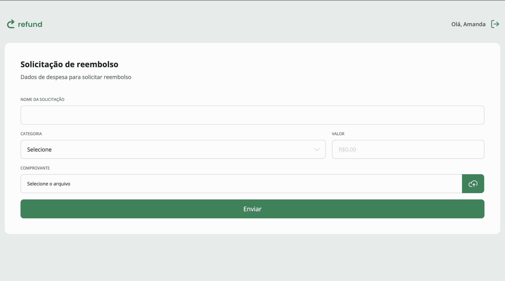
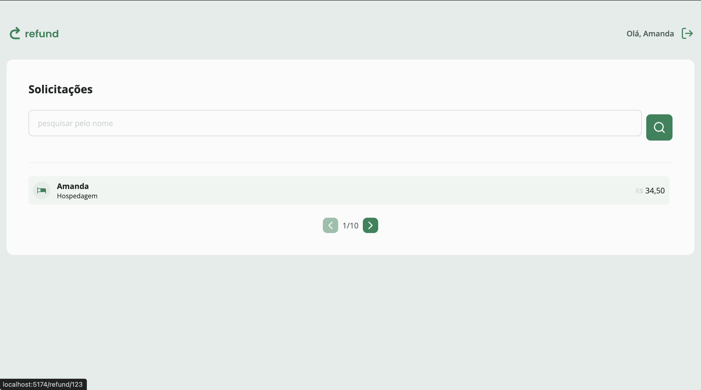

# 💸 Refund App — Full Stack

> Aplicação full stack para solicitação e gerenciamento de reembolso de despesas corporativas.
> Projeto desenvolvido com foco em **componentização**, **rotas protegidas** e **arquitetura modular** — do frontend ao backend.

---

## 📸 Preview

| Visão do Funcionário | Visão do Gestor |
|---|---|
|  |  |

---

## 📌 Sobre o Projeto

O **Refund App** é uma aplicação web completa onde funcionários solicitam reembolso de despesas e gestores acompanham e gerenciam essas solicitações.

O projeto foi desenvolvido do zero — **frontend e backend** — com atenção especial à componentização de UI, tipagem estática, validação de dados e controle de acesso por perfil de usuário.

🔗 Repositórios:
- **Frontend:** [github.com/amandasgm/refund](https://github.com/amandasgm/refund)
- **Backend (API):** [github.com/amandasgm/reefund-api](https://github.com/amandasgm/reefund-api)

---

## ✨ Funcionalidades

- 🔐 **Autenticação** — Páginas de login e cadastro de usuários
- 👤 **Rotas protegidas por perfil** — Acesso separado para funcionários e gestores
- 📋 **Formulário de reembolso** — Nome da solicitação, categoria, valor e upload de comprovante
- 📁 **Upload de arquivos** — Envio e armazenamento de comprovantes via Multer + DiskStorage
- ✅ **Validação de dados** — Entradas validadas com Zod no backend
- 🔒 **Autorização por roles** — Middleware que restringe acesso com base no perfil (`manager`, etc.)
- 📄 **Paginação e filtros** — Listagem de reembolsos com suporte a filtros básicos
- 🎨 **Interface responsiva** — Design moderno com Tailwind CSS

---

## 🗂️ Estrutura do Projeto

```
refund-app/
│
├── frontend/                   # Aplicação React (TypeScript + Vite)
│   ├── public/
│   └── src/
│       ├── assets/             # Recursos estáticos (imagens, ícones)
│       ├── components/         # Componentes reutilizáveis (Button, Input, etc.)
│       ├── pages/              # Páginas da aplicação (Refund, SignIn, etc.)
│       ├── routes/             # Configuração de rotas e proteção por perfil
│       ├── utils/              # Utilitários (categorias, helpers, etc.)
│       └── main.tsx            # Ponto de entrada da aplicação
│
└── backend/                    # API REST (Node.js + TypeScript + Express)
    ├── prisma/                 # Schema e migrations do banco de dados
    ├── uploads/                # Armazenamento local dos comprovantes
    └── src/
        ├── controllers/        # Lógica dos endpoints
        ├── middlewares/        # Autenticação e autorização por roles
        ├── providers/          # DiskStorage provider para gerenciamento de arquivos
        ├── routes/             # Definição das rotas da API
        ├── validators/         # Schemas Zod para validação de dados
        └── server.ts           # Ponto de entrada do servidor
```

---

## 🖥️ Frontend

### Tecnologias

| Tecnologia | Função |
|---|---|
| **React** | Biblioteca para construção de interfaces |
| **TypeScript** | Tipagem estática (95.5% do código) |
| **Vite** | Ferramenta de build rápida e moderna |
| **Tailwind CSS** | Framework CSS utilitário |
| **React Router** | Roteamento e proteção de rotas por perfil |
| **ESLint** | Linting e qualidade de código |

### Como rodar o frontend

```bash
# Clone o repositório
git clone https://github.com/amandasgm/refund.git
cd refund

# Instale as dependências
npm install

# Rode em modo de desenvolvimento
npm run dev
```

---

## ⚙️ Backend (API)

### Tecnologias

| Tecnologia | Função |
|---|---|
| **Node.js** | Runtime JavaScript |
| **Express** | Framework HTTP |
| **TypeScript** | Tipagem estática (100% do código) |
| **Prisma** | ORM para banco de dados |
| **Zod** | Validação de dados de entrada |
| **Multer** | Recebimento de arquivos via upload |
| **DiskStorage** | Provider de armazenamento local de arquivos |
| **JWT** | Autenticação e geração de tokens |

### Upload de Arquivos

Arquivos enviados são inicialmente salvos em pasta temporária pelo **Multer** e depois movidos para `UPLOADS_FOLDER` pelo provider **DiskStorage**. O provider também suporta deleção de arquivos quando necessário.

### Autorização

O middleware `verifyUserAuthorization` restringe o acesso a determinadas rotas com base no **role** do usuário (ex.: apenas `"manager"` pode acessar rotas de gestão de reembolsos).

### Como rodar o backend

```bash
# Clone o repositório
git clone https://github.com/amandasgm/reefund-api.git
cd reefund-api

# Instale as dependências
npm install

# Configure as variáveis de ambiente
cp .env.example .env

# Execute as migrations do banco de dados
npx prisma migrate dev

# Rode o servidor em modo de desenvolvimento
npm run dev
```

---

## 🔑 Variáveis de Ambiente

Crie um arquivo `.env` na raiz do backend com as seguintes variáveis:

```env
DATABASE_URL="file:./dev.db"
PORT=3333
UPLOADS_FOLDER="./uploads"
JWT_SECRET="sua_chave_secreta"
```

---

## 📡 Endpoints da API

| Método | Rota | Descrição | Acesso |
|---|---|---|---|
| `POST` | `/sessions` | Autenticação do usuário | Público |
| `POST` | `/users` | Cadastro de usuário | Público |
| `POST` | `/refunds` | Criar solicitação de reembolso | Funcionário |
| `GET` | `/refunds` | Listar todos os reembolsos | Manager |
| `GET` | `/refunds/:id` | Detalhar um reembolso | Manager |

---

## 👩‍💻 Autora

Desenvolvido por **Amanda** — frontend e backend integrados em um único projeto full stack.

[](https://github.com/amandasgm)

---

## 📄 Licença

Este projeto está sob a licença MIT. Veja o arquivo [LICENSE](LICENSE) para mais detalhes.
