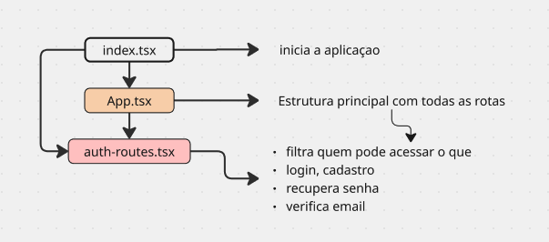

# Refund App Frontend

## Iniciando

- Instalando o react: `npm create vite@latest`
- Apagando pastas e limpando arquivos:
  - App.css (apagamos)
  - App.tsx (limpamos)
  - index.css (limpamos)
  - main.tsx (limpamos)
  - /public/... (limpamos)
  - /assets/... (limpamos)
  - eslint.config.js (apagamos)
- Apagamos todas as configuraçoes do esLint que vem instalado
- Trocando o favIcon no HTML
- Importando fonte no HTML

## Tailwind CSS

- INSTALANDO: `npm install tailwindcss @tailwindcss/vite`
- INSTALANDO: tailwind para classes e variantes ``` npm i tailwind-merge```
- CONFIGURANDO: dentro de vite.cofig.ts:

  ```
  import { defineConfig } from 'vite'
  import tailwindcss from '@tailwindcss/vite'

  export default defineConfig({
    plugins: [tailwindcss()],
  })

  ```
## CLSX 
- ✔️ Código mais limpo
- ✔️ Menos ternário feio
- ✔️ Fácil manutenção
- ✔️ Perfeito para Tailwind
``` npm install clsx ```

- IMPORTANDO NO CSS: dentro do index.css:
  - `@import "tailwindcss"`

### Extensao para Tailwind

- Tailwind CSS Intelicense (ja ta instalado)

### Customizando estilo

- No index.css:

```
@theme {
  --color-gray-100: #1f2523;
  --color-gray-200: #4d5c57;
  --color-gray-300: #cdd5d2;
  --color-gray-400: #e4ece9;
  --color-gray-500: #f9fbfa;

  --color-green-100: #1f8459;
  --color-green-200: #2cb178;

  --default-font-family: "Open Sans", serif;

  --text-xxs: 0.625rem;
}
```

- Ou pegamos alguma classe ja existente no tailwind e passamos outro valor, ou criamos uma classe do zero, tipo --text-xxs

### Instalando o React Router

- `npm i react-router`

## Arquivos de rota

- **routes/auth-routes.tsx:** rotas de autenticação, seprando rotas segundo perfil de usuario
- **routes/index.tsx:** responsavel por rederizar as rotas, qual tipo de rota sera carregada a depender do usuario, se ele esta logado ou nao.
- **App.tsx:** ponto de entrada que rederiza as rotas
- 

## AuthLayout
- Vai ser a rota publica que vamos usar para logar ou cadastrar usuario
- Importamos o ```import { Outlet } from "react-router";```
- Ele é como se fosse uma caixa vazia, esperando receber o objeto especifico 
- Tudo que esta fora dele se repete, seja la pagina de login ou na de cadastro 

# Refund App Backend
